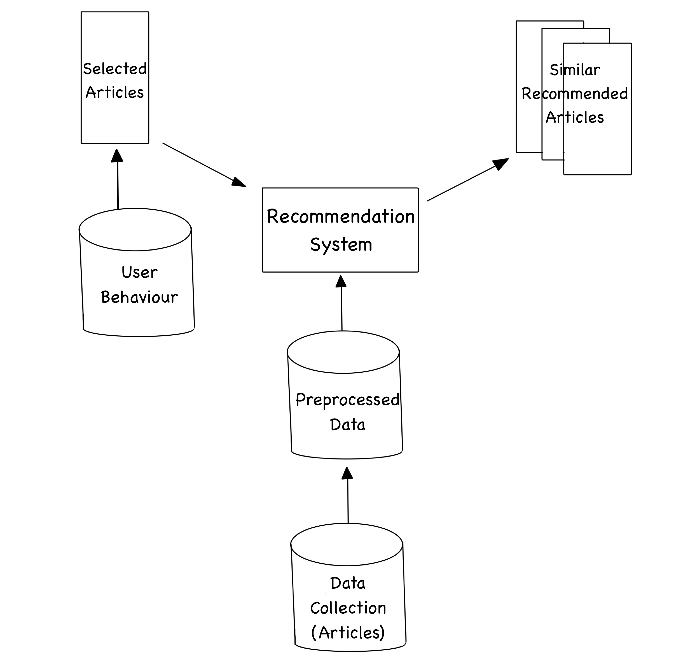

# Article-context-recommendation-system
 context-based article recommendation system that is implemented using several machine learning technologies. Among the approaches used are k-nearest neighbors (KNN), k-means clustering, decision trees, cosine similarity
 Architecture of the project
 
 

